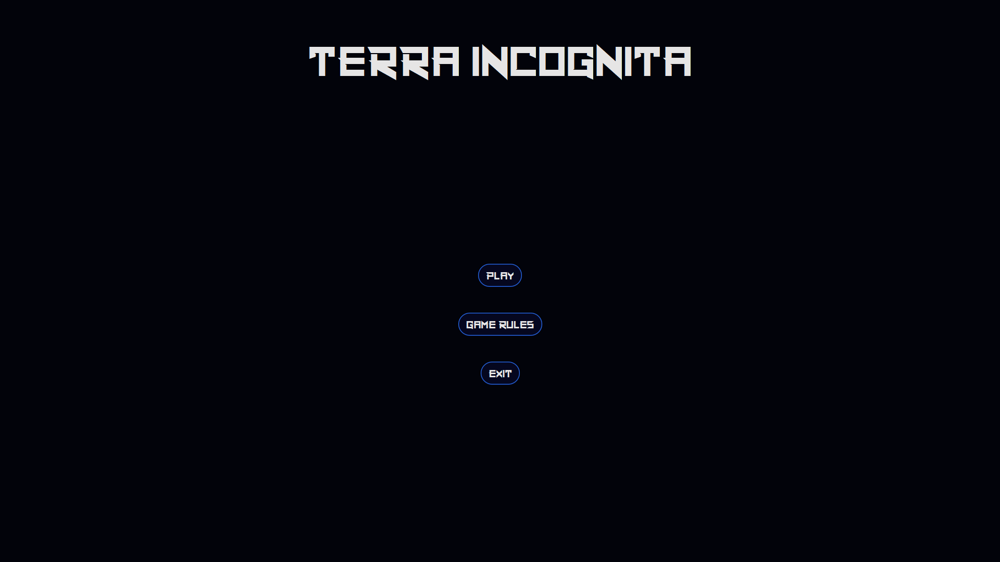
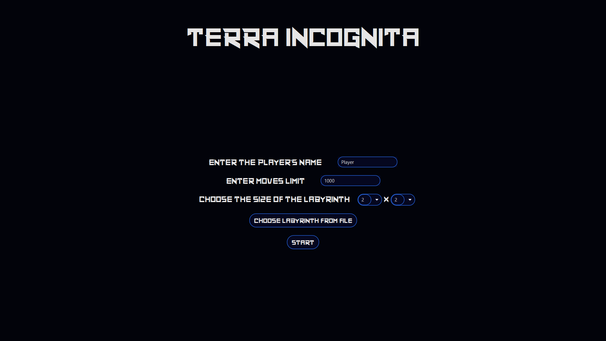
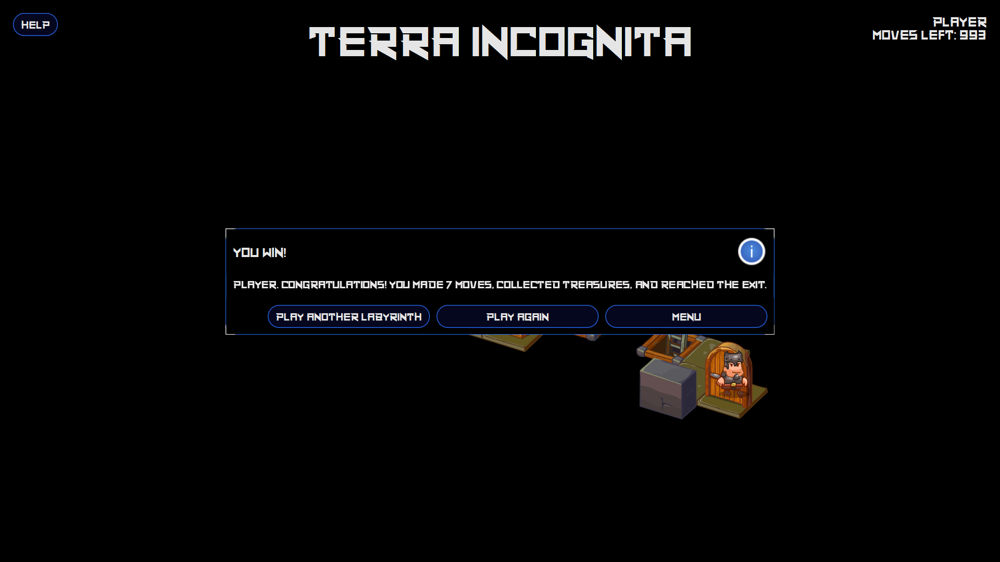
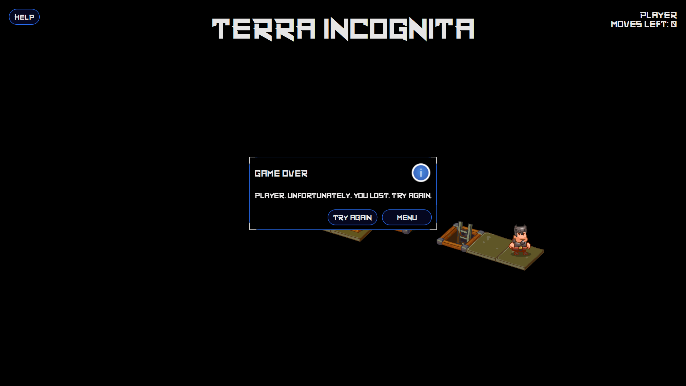
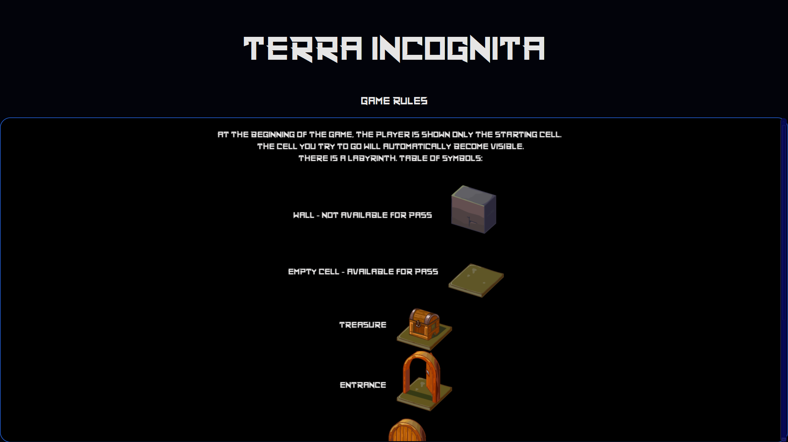
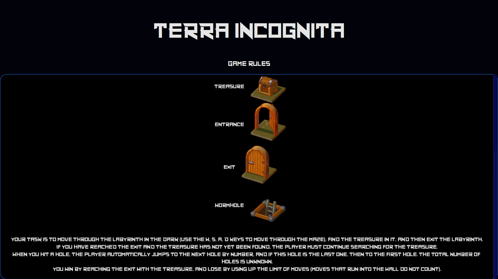

# Terra Incognita

 * [О проекте](#About_project)
 * [Правила](#Rules)
 * [Метод решения лабиринтов](#Algorithm)
 * [Иллюстрации игры](#Illustrations)

 ##     О проекте
 
 Проект представляет собой сильно упрощённую реализацию известной игры "Лабиринт" или "Terra incognita" с графическим интерфейсом
 и решателем лабиринтов (подробнее о правилах [здесь](#Rules "Правила игры")).
 Чтобы начать играть, необходимо в главном меню нажать кнопку Play, затем в соответствующих полях ввести имя игрока и лимит ходов,
 после чего выбрать размер предустановленного лабиринта с помощью выпадающих меню либо загрузить свой лабиринт из файла (кнопка Choose Labyrinth from file).
 Нажать старт и играть. Управление осуществляется с помощью кнопок W, A, S, D. Так же в игре имеется решатель лабиринтов, который
 находит путь к выходу вместе с сокровищем и выводит его на экран либо сообщает нам, что найти этот путь невозможно.

 ##     Правила игры
 
 В данном проекте реализована лишь малая часть правил.
 Подробная информация о правилах полноценной реализации имеется в статье Википедии 
 ["Лабиринт (игра на бумаге)"](https://ru.wikipedia.org/wiki/Лабиринт_(игра_на_бумаге) "https://ru.wikipedia.org/wiki/Лабиринт_(игра_на_бумаге)").
 
 Имеется лабиринт (дефолтные лабиринты приведены в каталоге `src/main/resources/labyrinths`).
 Обозначения: # стена (недоступна для прохода), T сокровище, S вход, E выход, 0-9 ямы с заданным номером (wormholes).
 Играет один игрок, всегда являющийся реализацией интерфейса `Player`.
 Его задача -- передвигаясь по лабиринту в темноте (делая шаги в любую из четырёх сторон), 
 найти в нём сокровище, а затем выход из лабиринта.
 При попадании в яму номер N игрок автоматически перескакивает в яму номер N+1,
 а если эта яма последняя -- то в яму номер 0. Общее количество ям неизвестно игроку.
 
 Важно, что игрок не видит карту лабиринта (объект типа `Labyrinth` недоступен в интерфейсе `Player`). 
 Перед началом игры ему сообщаются его начальные координаты и размеры лабиринта `setStartLocationAndSize`.
 Затем мастер (`GameMaster`) последовательно запрашивает у него очередной ход `Move` через `getNextMove`
 и сообщает результат хода `MoveResult` через `setMoveResult`.
 В результате игроку сообщается, удалось ли перемещение, что было в той клетке, куда он пытался пойти,
 текущее состояние `Condition` (найдено сокровище / не найдено, выход достигнут / не достигнут)
 и строку с описанием статуса.
 Игроку более НЕ СООБЩАЮТСЯ его текущие координаты 
 (в частности, при попадании в яму игрок не может определить свои новые координаты простыми способами).
 
 Игрок выигрывает, достигнув выхода с сокровищем, и проигрывает, израсходовав лимит ходов
 (ходы, упирающиеся в стену, при этом не считаются)

 Ограничения на лабиринты:
 
 * Все лабиринты -- прямоугольные, со всех сторон окружённые стенами
 * Максимальный размер 40 (ширина) х 25 (высота), минимальный 2 х 2
 * Есть минимум один вход, минимум один выход, и минимум одно сокровище
 * Лабиринт может содержать от 0 до 10 ям, нумерация их должна быть непрерывной от нуля до N - 1, где N -- их число. Не может быть двух ям с одинаковым номером.
 * При проверке решений могут использоваться лабиринты, отличные от имеющихся в примерах, но удовлетворяющие данным правилам
 
 ##     Метод решения лабиринтов
 
 Метод решения лабиринта заключается в следующем:
 
 Мастер запрашивает ходы (лимит – 1000). На каждом запросе хода решатель проверяет, нашёл ли он сокровище и знает ли он,
 где выход. Если нет, то берётся список всех направлений и фильтруется от тех направлений, при использовании которых решатель
 из текущего положения попадёт в положение, в котором он уже был (хранятся в карте map), а затем случайным образом берётся 
 одно из этих направлений и создаётся `WalkMove` с этим направлением. Оно (`WalkMove`) и возвращается в качестве результата метода
 `getNextMove()`.
 
 Если вдруг после фильтрации у нас пустое множество, то просто берём случайно одно из всех 4х направлений. 
 	
 При установке мастером результата хода, решатель заполняет свою карту и отмечает, нашел ли он сокровище, нашёл ли он выход.
 При попадании в червоточину карта очищается и решатель отмечает, что выход он не нашёл (не знает в какую позицию попал => не может знать и где выход).
 Если же решатель нашёл сокровище и знает, где выход, то вызывается функция `findPathToExit (from, previousPath)`,
 в которую передаётся текущее положение `from` (`previousPath` по умолчанию пустой). Если по карте `map` `from` это выход,
 то просто возвращаем `previousPath`. Иначе функция добавляет положение `from` в свой список посещённых (`visited`), 
 затем фильтрует направления и отбрасывает те, по которым мы уже ходили (`from + direction` in visited) и которые ведут 
 нас в стену или в червоточину (таким образом, мы избегаем ненужных ходов в стену и провалов в червоточину, которые влекут 
 за собой стирание карты и забытие, где выход) и возвращаем результат работы рекурсивно вызванной функцию поиска пути 
 `findPathToExit`, но уже из новых локаций `from + direction` (те, которые мы отфильтровали) и с `previousPath`, 
 содержащим весь предыдущий путь (добавляем к нему и новое направление), а также из всех путей выбираем путь с минимальной длиной.
 В итоге функция вернула нам список `direction` и теперь решатель по одному достаёт из него направления и возвращает мастеру `WalkMove(direction)` при вызове `getNextMove()`.
 
 Так происходит одна итерация. Чтобы повысить шансы на нахождение пути, прибегнем к следующему:
 
 Создаём `Searcher`, `GameMaster` с переданными в него лабиринтом и игроком `Searcher`. Затем делаем 10000 итераций, на 
 каждой из которых сначала сбрасываем `Searcher` и `GameMaster`, затем заставляем мастера запрашивать ходы 
 (`gameMaster.makeMoves(1000)`), после чего анализируем результат: если достигли выхода и размер пути удовлетворяет 
 заданному лимиту, то возвращаем этот путь. Иначе дальше повторяем итерации. Если под конец всех итераций путь так и не 
 был найден, возвращаем пустой список.

 
 ##     Иллюстрации
 
 ### Главное меню
 
 
  
 #### Подготовка к игре
 
 Ввод имени игрока, лимита ходов, выбор лабиринта
 
 
 #### Вы выиграли
 
 
 
  #### Вы проиграли
  
  
  
  #### Правила игры 
  
  
  
  
 